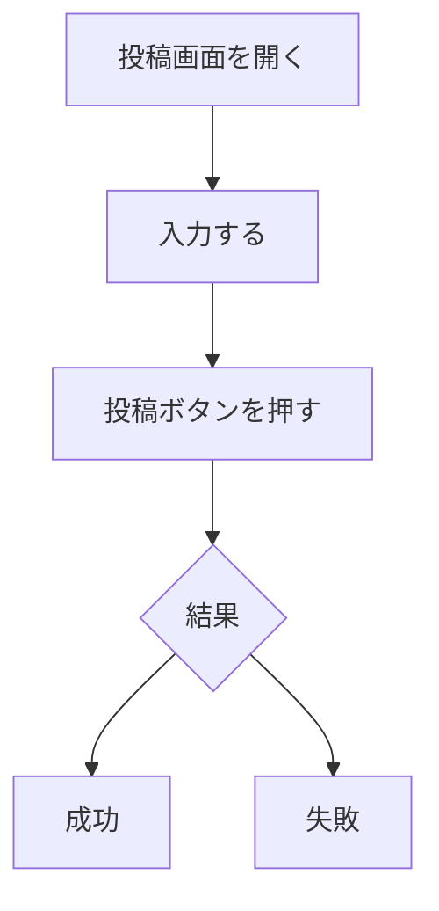
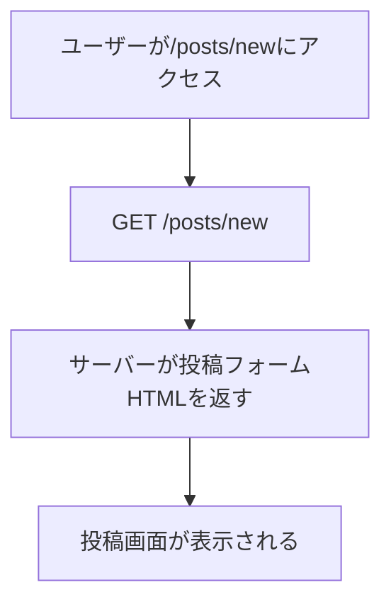
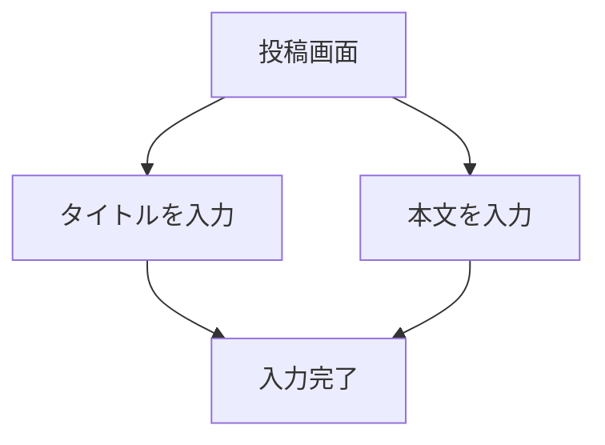
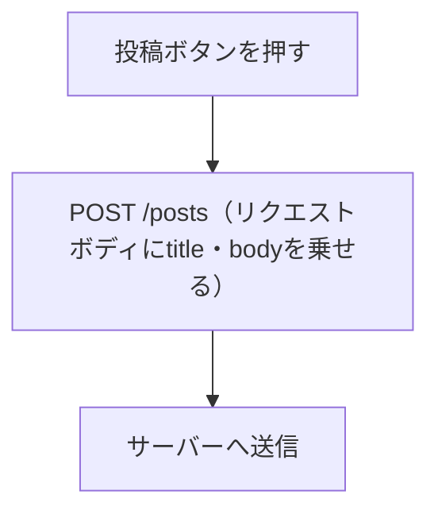
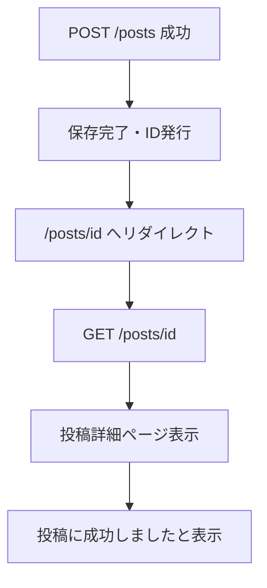
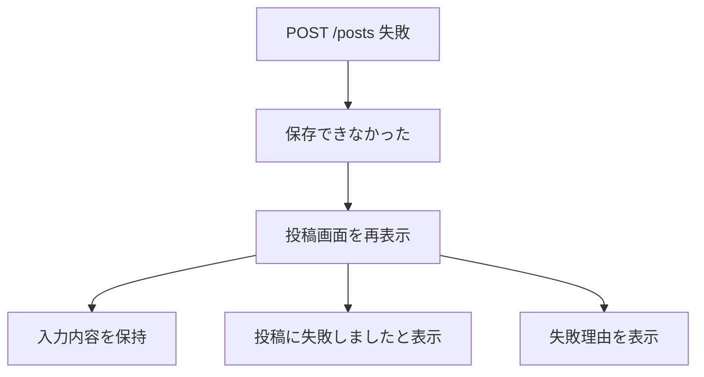
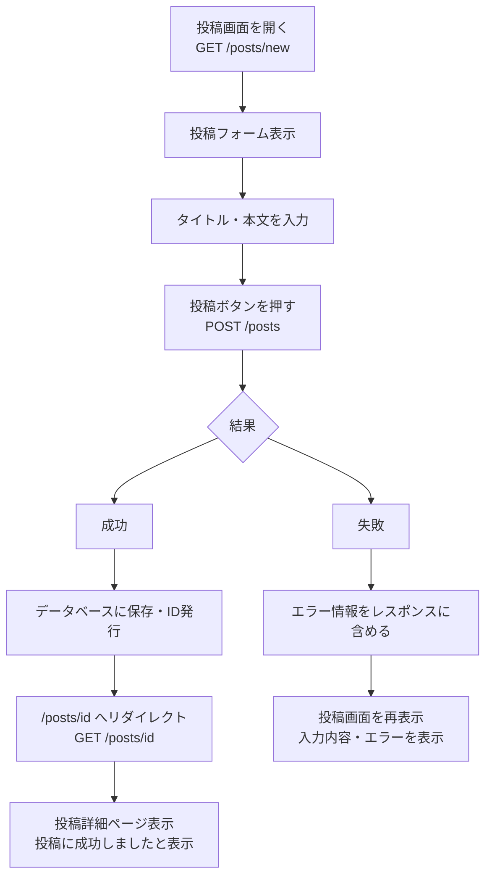

## やりたいことを理解しているかい？
何かしらの教材でも、あるいは個人開発でも、何でもよいです。今からやろうとしていること＝やりたいことはなにか、理解していますか？
「これをやってください」「これをやりたい」となったとき、いきなり実装し始めていませんか？
実装できたとて、何故、どこに、何を書いたか説明できますか？
ここを理解できず進めるとどうなるか

エラーが出たら「なんでこのエラーが出ているか分かりません」
想定外の挙動に「どこをどうしたら直るか分かりません」
行き着く先は「何を変更したか分からないです。どういう状態かも分かりません」

エラーが出たときに、エラーやそのログを読んで理解できる人はそもそも自分がやったことを把握できている人です。
「このエラーってことは、こういう状態である」「ってことはここが怪しいかもしれない」までいけます。もしそれで解決できなかったとしても「自分はこうだと思った、だからこうした、しかしダメだった、何故か」と思考や試行を言語化できるので、検索したり人に尋ねたりするハードルが下がります。
本人の心理的な部分はさておき、聞かれた側としては「その人がどこまで把握していてどのように考えているのか」が分かるので伝えやすいです。
なぜなら「ここまで分かってそう、ってことはここが分からなそう」だったり「ここがそもそも間違えて理解していそうだからそこから話そう」とか、伝え方を構成しやすいからです。

ときにはエラーがでないけどおかしい、ということもあります。それが想定外の挙動です。プログラム的には正常、しかし挙動がおかしい。
この手のタイプはエラーが出ないので、何を実装してどうなったか、を把握していなければ修正が難しいです。ログを見て「ああ、ってことはここか」ってなる人は先程と同じく自分がやったことを把握できている人です。

Git管理なら変更差分が分かるって？たしかにそうでしょう。ブランチを変更していればmainブランチとの差分から「このブランチではここを変更している」とわかるでしょう。
残念ながら何を変更したか把握できていない人は、往々にしてGitを良く分かっていません。人によっては「ぎっと？ってなに？」という方もいることでしょう。
え？SVN？アイツはダメだ、扱いづらすぎる。業務で一回使ったことあるけどまあまあ意味分からなかったぞ。未だに怪しいもん。

「いきなりコードを書くなって？じゃあ何をすればいいのさ」
今からその話をしましょう。

## 自然言語でまず書く

まずは何をしたいのか自然言語で書いてきましょう。
いきなり具体的な内容を書いていくのではなく、まずはざっくり、次に分解、更に分解、と徐々に小さくしていきます。

### 例題：投稿機能を作る
まずは要求を書きますね。

- タイトルと本文を投稿できるようにしてください
- 投稿ボタンを押したら投稿できるようにしてください
- 投稿に成功したら投稿詳細ページに遷移し、投稿した内容を見れるようにしてください
- 投稿に失敗したら、投稿画面のままにしてください

更に具体的な仕様を提示します。

- タイトルと本文は必須です
- 投稿に成功したら「投稿に成功しました」と表示してください
  - ただし別のページに遷移したりリロードしたりしたらこの表示は消えてください
- 投稿に失敗したら「投稿に失敗しました」と表示してください
  - 何故投稿に失敗したか理由も併せて表示してください

上記を土台に、何をしたいか自然言語で書いていきます。

### 全体フローを書く
全体の流れをまずざっくり書きましょう。ここは要求や仕様でだいたい書かれてますね。

1. 投稿画面を開く
2. 入力する
3. 投稿ボタンを押す
4. 結果
    - 成功
    - 失敗

こんくらいざっくりでいいです。図にも起こしてみましょう。



### 各流れの状態を書き出す
各流れでどのような状態かを書き出します。細かすぎないのがポイントです。

#### 1. 投稿画面を開く
投稿画面が開かれてる、で終わってはいけません。
この投稿画面はどのような表示がされていますか？要求に書いてありますね。

> まずは要求を書きますね。
> - タイトルと本文を投稿できるようにしてください
> - 投稿ボタンを押したら投稿できるようにしてください

タイトルと本文が投稿できるようにということは、タイトルと本文を入力できるフォームがあります。
投稿ボタンを押したらとあるので、投稿ボタンもありますね。
ということで投稿画面は次の状態であることが分かります。

- 入力フォームがある
  - タイトル
  - 本文
- ボタンがある
  - 投稿

#### 2. 入力する
入力フォームに入力しているだけなので、今回の要求・仕様であればここは投稿画面の状態で入力しているだけであることは間違いないです。
もし例えば「入力したら文字数が表示されるようにしてほしい」と言った要求があれば、ここの入力するフローでの画面は少し変わりますね。
ただ今回は入力していること以外に変化は一旦ないものとします。

#### 3. 投稿ボタンを押す
こちらもボタンを押すこと以外は投稿画面のままですね。
押したことによって変化がありますがそれは4. 結果の話なのでここでは状態の変化はないものとします。

#### 4. 結果
投稿ボタンを押したことにより結果が表示される状態です。
ここでは分岐がありましたね。それぞれの分岐の内容を洗い出します。

##### 成功
要求にはこのようにあります。
> 投稿に成功したら投稿詳細ページに遷移し、投稿した内容を見れるようにしてください

そして仕様にはこのようにあります。
> 投稿に成功したら「投稿に成功しました」と表示してください
>  - ただし別のページに遷移したりリロードしたりしたらこの表示は消えてください

別ページに遷移やリロードの話は、結果より後のフローなのでひとまず置いておくことにします。
まとめると成功においての状態は次のとおりです。

- 投稿詳細ページが表示される
- 「投稿に成功しました」と表示されている

なお、投稿詳細ページは今回の投稿機能とは別の機能とします。なので詳細ページの具体的な仕様は触れません。

##### 失敗
要求によると
> 投稿に失敗したら、投稿画面のままにしてください

仕様では
> 投稿に失敗したら「投稿に失敗しました」と表示してください
>  - 何故投稿に失敗したか理由も併せて表示してください

とのことなのでまとめると次になります。
- 投稿画面が表示されている
- 入力フォームは入力内容が表示されている
- 「投稿に失敗しました」と表示されている

#### まとめ
ここで分かるのは「どのような表示が必要なのか」です。
実装では「この表示をしなければならない」というのが洗い出せています。
どのフレームワークであっても、見た目を司る実装部分はあるはずです。そこに実装しないといけないものが今回洗い出した状態にあたります。

洗い出したものをまとめておきましょう

1. 投稿画面を開く
    - 入力フォームがある
      - タイトル
      - 本文
    - ボタンがある
      - 投稿
2. 入力する（変化無し）
3. 投稿ボタンを押す（変化無し）
4. 結果
    - 成功
        - 投稿詳細ページが表示される
        - 「投稿に成功しました」と表示されている
    - 失敗
        - 投稿画面が表示されている
        - 入力フォームは入力内容が表示されている
        - 「投稿に失敗しました」と表示されている

### ルーティングを書き出す
これまでは見た目の話だけでした。ここからは一歩内部の話に入ってきます。
各流れは書き出されているので、その流れに則ってルーティングを書き出していきましょう。

#### てかルーティングって何
ユーザーが「これしたいよー！」と要望を出したときにサーバーが「その要望ってことはこの内容返すね！」と紐づけるものです。
書き出し作業で触れていくので掴んでください。

#### HTTPリクエストとルーティング
ユーザーが「これしたいよー！」と要望を出すことをリクエストといいます。
サーバーが「ソロのリクエストってことははいこれね！」と内容を返すのをレスポンスといいます。
このリクエストとレスポンスにはルールがあります。このルールを**HTTP（ハイパーテキスト転送プロトコル）**と呼びます。
なのでHTTPに則ったリクエストをHTTPリクエスト、HTTPに則ったレスポンスをHTTPレスポンスといいます。
⋯⋯ここまで良いですか？まだ行きますよ？
HTTPリクエストには書き方があります。そのなかにリクエストメソッドと呼ばれるものがあります。

https://developer.mozilla.org/ja/docs/Web/HTTP/Reference/Methods

まあつまり、情報が欲しいのか、情報を作りたいのか、情報を更新したいのか、情報を削除したいのか、などどのようなリクエストを飛ばしたいのか、というのをリクエストメソッドを使って要求するのです。
複数ありますがおさえておけばよいのは次の表です。

| 要求 | HTTPリクエストメソッド |
| :-- | :-- |
| 情報が欲しい | GET |
| 情報を作りたい | POST |
| 情報を全て更新したい | PUT |
| 情報を一部更新したい | PATCH |
| 情報を削除したい | DELETE |

ルーティングは基本的に一意（重複しない、ただ1つであること）である必要があるのですが、HTTPリクエストのメソッドが異なっていればURLが同じでも使い方が変わります。
例題が投稿なので投稿という前提にしますが、よくあるパターンは次のとおりです。

| 要求 | ルーティング | HTTPリクエストメソッド |
| :-- | :-- | :-- |
| 投稿一覧が欲しい | `/posts` | GET |
| 1件の投稿が欲しい | `/posts/{id}` | GET |
| 投稿してデータを作りたい | `/posts` | POST |
| 投稿データを全て更新したい | `/posts/{id}` | PUT |
| 投稿データを一部更新したい | `/posts/{id}` | PATCH |
| 投稿データを削除したい | `/posts/{id}` | DELETE |

一覧が欲しいときは、特定の1件ではなく全てなので`/posts`だけです。投稿時もまだデータが存在しているわけではないので`/posts`です。
2つとも`/posts`と同じですがHTTPリクエストメソッドが異なるため、ルーティングとしては別のものという扱いになります。
一方、1件取得や更新、削除は特定の1件に対する要求なので`/posts/{id}`とルーティングに投稿idを含めることで、どの投稿に対する操作か分かります。そしてこの3つも`/posts/{id}`ですがルーティングとしては別のものという扱いになります。

⋯⋯大丈夫ですか？ついてこれてますか？
ここは前提条件です。この後のルーティングを書き出すところにでてくるので、分からなくなったら戻ってきて再読してください。

#### 1. 投稿画面を開く
ここは非常に分かりやすく、投稿画面のURLだと思ってOKです。
例えば`https://hogehoge.com/posts/new`であれば`/posts/new`の部分がルーティングになります。
ユーザーが`https://hogehoge.com/posts/new`にアクセスする＝ユーザーが「投稿画面みたいよー！」と要望を出します。
サーバーが`/posts/new`の要望が来ていると分かる＝サーバーが「それに対応する内容を返せばいいんだな！」と内容と紐づけます。
ルーティングはあくまで紐づけなので、ルーティング自体は「内容」を作っていません。
じゃあこの内容ってどこで作ってるの？という話になりますが、それはこのあと触れていくのでここでは置いといてください。
投稿画面では`/posts/new`がルーティングになる、ということをおさえておきます。
では、HTTPリクエストメソッドだとGET, POST, PUT/PATCH, DELETEのどれにあたるでしょう？
答えはGETです。投稿データはないですが、どんな画面を表示させるかという情報を取得しているのでGETになります。

#### 2. 入力する
ここは投稿画面で入力しているだけですね。
入力時にルーティングは動かないの？で言うと、入力中にサーバーに対してあれやってこれやってと要求していないのでここでは何もありません。
入力したら即時になにかやってほしい、ということであれば、やってほしいことによってはサーバーに要求することもあります。が、今回はないので気にしなくてよいです。
なのでルーティングは変化なくGETの`/posts/new`です。

#### 3. 投稿ボタンを押す
投稿ボタンを押したということは、入力した内容をデータとして保存したり何だりかんだりします。
つまりサーバー側に「この入力を保存してー！」と要求を出すことになります。ということは？そう、ルーティングがでてきます。
ユーザーが見えるURLとしては`/posts/new`のままです。しかし裏側ではどこかへデータを送信しているわけですね。
ここででてくるのが先程の表です。

| 要求 | ルーティング | HTTPリクエストメソッド |
| :-- | :-- | :-- |
| 投稿一覧が欲しい | `/posts` | GET |
| 1件の投稿が欲しい | `/posts/{id}` | GET |
| 投稿してデータを作りたい | `/posts` | POST |
| 投稿データを全て更新したい | `/posts/{id}` | PUT |
| 投稿データを一部更新したい | `/posts/{id}` | PATCH |
| 投稿データを削除したい | `/posts/{id}` | DELETE |

今回はデータを作成したいので、POSTの`/posts`ですね。

#### 4. 結果
ここは分岐がありますね。それぞれ見てみます。

##### 成功
成功したら詳細ページが表示されてほしいです。
ということは先ほど投稿した1件を取得したいですね。
ですので、GETの`/posts/{id}`がここでのルーティングです。

##### 失敗
失敗したら投稿フォームのままでいてほしいので、1. 投稿画面を開くと同じ状態となります。
しかしフォームには入力したものがそのまま残っていてほしいとあります。
ですので、GETの`/posts/new`のルーティングに

### データの流れを書き出す
ルーティングは「どこへリクエストを送るか」でした。
データの流れは「投稿データがどこを流れるか」です。投稿データ＝タイトルと本文です。それがどこにあって、どこへ移動するかを追いかけましょう。

#### 1. 投稿画面を開く
この段階では投稿データはまだ存在していません。ユーザーがこれからタイトルと本文を入力する前の状態です。

#### 2. 入力する
ユーザーが入力したタイトルと本文はブラウザ上にあります。まだサーバーには届いていません。

#### 3. 投稿ボタンを押す
入力したタイトルと本文がサーバーへ送信されます。

送信するデータ：
- タイトル（title）
- 本文（body）

#### 4. 結果

##### 成功
サーバーは受け取ったタイトルと本文をデータベースに保存します。保存時に投稿IDが発行されます。
投稿詳細ページでは、保存されたタイトルと本文が表示されます。

##### 失敗
投稿データが保存できなかった場合、入力されていたタイトルと本文はそのまま返ってきます。
これにより、フォームに入力していた内容が保持されます。

#### まとめ
投稿データの流れをまとめると次のとおりです。

- 投稿画面を開く：投稿データはまだ存在しない
- 入力する：ブラウザ上にタイトルと本文が生まれる
- 投稿ボタンを押す：タイトルと本文がサーバーへ届く
- 成功：タイトルと本文がデータベースに保存される
- 失敗：タイトルと本文がそのまま返ってくる

### まとめ
ここまで自然言語で書き出した内容を整理してみましょう。

- 各フローの状態（どのような画面・表示がされているか）
- ルーティング（どのURLにどのHTTPメソッドでリクエストするか）
- データの流れ（投稿データがどこを流れるか）

コードを書き始める前にここまで整理できていれば、実装中に迷う回数が格段に減ります。少なくとも「何をすべきか」で迷うことはなくなります。

## 各流れを図にまとめる
各フローを図にしてみましょう。自然言語で書いた内容を視覚化することで、更に把握しやすくなります。

#### 1. 投稿画面を開く



#### 2. 入力する



#### 3. 投稿ボタンを押す



#### 4. 結果

##### 成功



##### 失敗



#### まとめ
図にすると各フローの流れが一目で把握できますね。
ルーティングやデータの流れも含まれているので、実装の際にどこで何をすべきかが分かりやすいです。
なお、図はあくまで理解を助けるためのものです。完璧な図を書こうとするよりも、自分が理解できる粒度で書けていれば十分です。

## 全体を図にまとめる
各フローをひとつの図にまとめてみましょう。



全体を俯瞰するとこのようになります。各フローが繋がって投稿機能の全体像が見えてきましたね。

## 実装前準備

### アーキテクチャに則ってどこに書くかを考える
「実装する」といっても、どのファイルに書けばいいか分からないと手が止まりますよね。
これはアーキテクチャ（設計・構造）を理解することで解消できます。

#### 例：MVCアーキテクチャ
MVCとは**M**odel・**V**iew・**C**ontrollerの略です。よく使われる設計パターンです。

| 役割 | 担当 |
| :-- | :-- |
| Model | データの保存・取得 |
| View | 画面の表示 |
| Controller | リクエストを受け取り、ModelとViewをつなぐ |

先程書き出したルーティングをMVCに当てはめると次のとおりです。

| ルーティング | HTTPメソッド | 担当 |
| :-- | :-- | :-- |
| `/posts/new` | GET | Controller（new） + View（投稿フォーム） |
| `/posts` | POST | Controller（create） + Model（保存） |
| `/posts/{id}` | GET | Controller（show） + Model（取得） + View（詳細ページ） |

「誰がどのリクエストを受け取って、どこに何をしてもらって、何を返すか」を整理するとMVCのどこに書けばよいかが見えてきます。

#### 例：Ruby on Rails
RailsはMVCアーキテクチャを採用しているフレームワークです。先程の対応をRailsのファイル構成に当てはめると次のとおりです。

| 役割 | ファイル |
| :-- | :-- |
| Model | `app/models/post.rb` |
| View（投稿フォーム） | `app/views/posts/new.html.erb` |
| View（詳細ページ） | `app/views/posts/show.html.erb` |
| Controller | `app/controllers/posts_controller.rb` |

Controllerの中には`new`・`create`・`show`というアクション（メソッド）を書きます。それぞれ先程のルーティングに対応しています。
使っているフレームワークやアーキテクチャが異なっても、「どこに何を書けばよいか」を把握するという考え方は共通です。

### 実装の流れを考える

#### 実装の順番
実装する順番を決めておきましょう。行き当たりばったりで書き始めると、後で「あ、ここが必要だった」となって戻ることが増えます。

Railsを例にすると、Model → View → Controllerの順が安定しやすいです。
データの構造（Model）を先に固めると、ViewやControllerを書く際に「このデータがここに入ってくる」とイメージしやすくなります。
ただし、これは一例です。チームのルールやプロジェクトの方針に合わせましょう。大事なのは「なんとなくで進めない」ことです。

#### 動作確認するポイントを決める
実装中にどこで動作確認するかを事前に決めておくと、実装の区切りが分かりやすくなります。今回であれば次のポイントを確認します。

- 投稿フォームが表示される
- タイトル・本文が空の状態で投稿するとエラーが出る
- タイトル・本文を入力して投稿すると詳細ページへ遷移する
- 詳細ページで「投稿に成功しました」と表示される
- 投稿に失敗した際、投稿画面のままエラーが表示される
- エラー時、入力していた内容がフォームに残っている

これらを全て確認できたら投稿機能の完成です。

### 実装前に細かく段階分けする
動作確認するポイントが決まったら、それに向けて実装を細かく段階分けしましょう。
「全部まとめて書いてから動作確認」はなるべく避けましょう。どこで何が起きているか分からなくなります。

Railsを例にした段階分けはこのようになります。

1. Postモデルを作成する
2. データベースにテーブルを作成する
3. PostsControllerを作成し`new`・`create`・`show`アクションの枠を作る
4. ルーティングを設定する
5. 投稿フォームのViewを作成する（動作確認：フォームが表示されること）
6. `create`アクションに保存処理を書く（動作確認：投稿できること・失敗すること）
7. 詳細ページのViewを作成する（動作確認：詳細ページが表示されること）
8. フラッシュメッセージを追加する（動作確認：成功・失敗メッセージが表示されること）

こんな感じで小さく進めると、「どこまで動いていてどこから動いていないか」が常に分かります。

## 実装

#### 枠から作っていく
段階分けしたものを実装していきましょう。まずは「動く枠」を作ることを意識します。

例えばControllerであれば、最初はこんな感じで十分です。

```ruby
class PostsController < ApplicationController
  def new
  end

  def create
  end

  def show
  end
end
```

中身は何もありません。しかしルーティングが正しく設定されていれば、`/posts/new`にアクセスした際にこのControllerの`new`アクションが呼ばれます。
「ルーティングが刺さっていること」を確認できればOKです。「白紙のフォームが開いたら第一段階クリア」くらいの気持ちで進めましょう。

#### 具体的に書いていく
枠ができたら中身を書いていきます。
データの流れで書き出した内容を見ながら、「このタイミングで何のデータが必要か」を確認しながら書いていきましょう。

先程の動作確認するポイントを1つずつクリアするイメージで進めると整理しやすいです。
「フォームが表示されること」を確認 → 「投稿できること」を確認 → 「エラーが出ること」を確認、という順番です。

詰まったら、まず自分がやったことを言語化しましょう。「この処理を追加したらこうなった。でも期待していた動作はこうだった。」と整理するだけで、解決の糸口が見えやすくなります。

#### コミットする
1つの動作確認ポイントをクリアしたらコミットしましょう。
こまめにコミットすることで「どこまで動いているか」が常に分かります。詰まったときに「一旦前の状態に戻す」という選択肢も取りやすくなります。
「どこをどう変更したか分かりません」という状態を避けるためにも、コミットは小さく頻繁に行いましょう。

## 言いたいこと

### 一度に理解するのではなく、ポイントを区切って理解する
「HTTPのこと全部理解してから書きます」は無理です。「MVCを完全に把握してから書きます」も現実的ではありません。
書きながら、必要な部分を必要なだけ理解していくのが現実的なやり方です。

ただし「今自分が何を理解していて、何を理解していないか」を把握した上で進めることが大切です。
そのために今回やった自然言語での書き出しが役に立ちます。
「ここまでは分かった。次にこれが必要だ。これはまだ分からないから調べよう。」という進め方ができるようになります。

### AIに書かせるのは自分が実装できる範囲に留める
AIにコードを書かせるのは便利です。複雑な処理も一瞬で書いてくれます。
しかし「なぜそう書くか説明できないコード」は借金です。

エラーが出たとき、想定外の挙動が起きたとき、仕様が変わったとき。そのたびに「このコード何してるんだっけ」となります。理解していないコードは使いこなせません。

「自分で書けるけど時間の節約にAIを使う」が健全な使い方です。「書けないからAIに書かせる」が続くと、自分で書ける範囲が広がっていきません。
今回やったような「実装前の整理」はAIに手伝ってもらうのも良いですが、思考の訓練として自分でやってみることを強くお勧めします。コードを書く力より、考える力の方が長い目で見て大事です。

